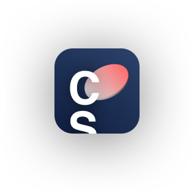

     

  

<h1>Cointracker App created within 3 days as part of a challenge</h1>

🖥 Video showcasing the functionality of the App:
https://youtu.be/giDgkB1qAO0
 

* 💵 Tracks & Observes the price & pricechange of BTC, ETH & LTC using the https://apiv2.bitcoinaverage.com API
* 📈 Draws a pricechart that can be adjusted to daily/monthly/alltime settings
* 📊 Calculates the 1D RSI 
* 🧠 Assesses the current Twitter Sentiment of given projects using CoreML

 
<h3>Setup</h3>

Git clone & copy the Xcodefile  📄 <b>Swifter</b> from https://github.com/mattdonnelly/Swifter at the directory of your folder structure - Done!
 
